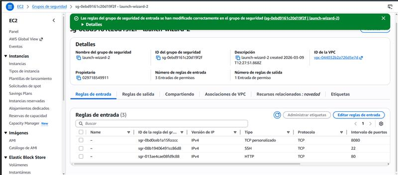
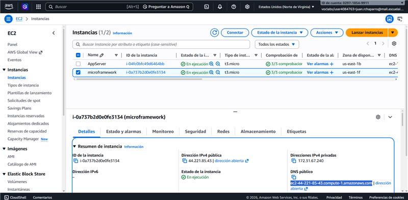
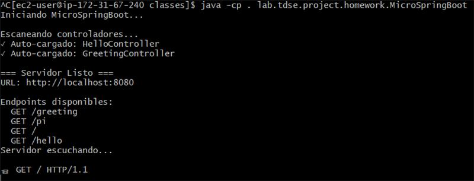

# TallerMicroSpringboot 🚀

Servidor Web Java con capacidades IoC (Inversión de Control) construido desde cero usando reflexión, sin frameworks externos.

## 📋 Descripción

Este proyecto implementa un servidor web minimalista en Java que:
- Atiende peticiones HTTP GET
- Sirve páginas HTML e imágenes PNG
- Provee un framework IoC para construcción de aplicaciones web usando POJOs
- Utiliza anotaciones personalizadas y reflexión para mapear rutas a métodos
- Soporta parámetros de query con valores por defecto

## 🎯 Características Implementadas

### Anotaciones Personalizadas
- **@RestController**: Marca una clase como controlador REST
- **@GetMapping**: Mapea un método a una ruta HTTP GET
- **@RequestParam**: Inyecta parámetros de query en métodos

### Servidor HTTP
- Servidor multi-solicitud no concurrente
- Puerto: 8080
- Soporta archivos estáticos (HTML, PNG)
- Manejo de códigos de respuesta HTTP (200, 404, 405, 500)

### Framework IoC
- Carga de beans (POJOs) mediante reflexión
- Escaneo automático de clases con @RestController
- Invocación dinámica de métodos
- Inyección de parámetros automática

## 🛠️ Tecnologías

- **Java 21 LTS**
- **Maven** para gestión del proyecto
- **Reflexión de Java** para introspección y manipulación dinámica

## 🚀 Uso

### Compilar el proyecto

```bash
mvn clean compile
```

### Ejecutar el servidor

**Opción 1: Escaneo automático de controladores**
```bash
java -cp target/classes lab.tdse.project.homework.MicroSpringBoot
```

**Opción 2: Especificar controlador desde línea de comandos**
```bash
java -cp target/classes lab.tdse.project.homework.MicroSpringBoot lab.tdse.project.homework.HelloController
```

### Probar el servidor

Una vez iniciado, abre tu navegador en:
- http://localhost:8080/index.html (página de inicio)
- http://localhost:8080/ (endpoint raíz)
- http://localhost:8080/hello
- http://localhost:8080/pi
- http://localhost:8080/greeting?name=TuNombre

### Ejecutar Tests Automatizados

El proyecto incluye **18 tests JUnit 5** que verifican la funcionalidad del framework:

```bash
# Ejecutar todos los tests
mvn test

# Compilar y ejecutar tests
mvn clean test
```

**Suites de tests incluidas:**

1. **AnnotationsTest** (6 tests)
   - Verificación de anotaciones @RestController, @GetMapping, @RequestParam
   - Validación de valores por defecto en parámetros
   - Verificación de modificadores (public, static) en métodos

2. **ReflectionScannerTest** (5 tests)
   - Escaneo de controladores con reflexión
   - Extracción de valores de anotaciones
   - Invocación dinámica de métodos con y sin parámetros

3. **ControllerTest** (7 tests)
   - Funcionalidad de endpoints
   - Validación de respuestas de controladores
   - Accesibilidad de métodos públicos

**Resultado esperado:** ✅ Tests run: 18, Failures: 0, Errors: 0

## 📝 Ejemplo de Controlador

```java
@RestController
public class GreetingController {
    
    @GetMapping("/greeting")
    public static String greeting(@RequestParam(value = "name", defaultValue = "World") String name) {
        return "Hola " + name;
    }
}
```

## 📂 Estructura del Proyecto

```
src/main/java/lab/tdse/project/
├── homework/                   # 🚀 MICROFRAMEWORK WEB (Taller Principal)
│   ├── MicroSpringBoot.java       # Servidor HTTP principal
│   ├── RestController.java         # Anotación @RestController
│   ├── GetMapping.java            # Anotación @GetMapping
│   ├── RequestParam.java          # Anotación @RequestParam
│   ├── HelloController.java       # Controlador de ejemplo
│   ├── GreetingController.java    # Controlador con parámetros
│   └── MicroSpringBootg3.java     # Versión inicial (línea de comandos)
│
└── ejemplos_clase/             # 📚 EJEMPLOS DE REFLEXIÓN (Desarrollo en Clase)
    ├── Test.java                  # Anotación @Test (similar a JUnit)
    ├── RunTests.java              # Ejecutor de tests con reflexión
    ├── Foo.java                   # Clase de ejemplo con tests
    ├── InvokeMain.java            # Invocador de métodos main()
    └── ReflexionNavigator.java    # Inspector de clases

src/main/resources/static/
└── index.html                 # Página de inicio
```

## 🔄 Versiones

### Versión 1 (MicroSpringBootg3)
- Carga de POJO desde línea de comandos
- Soporte básico para @GetMapping
- Invocación de métodos estáticos

### Versión 2 (MicroSpringBoot) - **Actual**
- Servidor HTTP completo en puerto 8080
- Escaneo automático de controladores
- Soporte para @RequestParam con valores por defecto
- Servir archivos estáticos (HTML, PNG)
- Manejo de múltiples solicitudes
- Manejo de errores HTTP

---

## 📚 Ejemplos de Reflexión Desarrollados en Clase

El proyecto incluye ejemplos prácticos de reflexión desarrollados durante las sesiones de laboratorio en el paquete `ejemplos_clase/`:

### 🧪 **Mini Framework de Testing** (RunTests + @Test)
Un framework de pruebas similar a JUnit que demuestra el poder de la reflexión.

**Componentes:**
- **@Test**: Anotación para marcar métodos de prueba
- **RunTests**: Ejecutor que encuentra y ejecuta métodos con @Test
- **Foo**: Clase de ejemplo con tests (algunos pasan, otros fallan)

**Ejemplo de uso:**
```bash
# Compilar
mvn clean compile

# Ejecutar tests
java -cp target/classes lab.tdse.project.ejemplos_clase.RunTests lab.tdse.project.ejemplos_clase.Foo
```

**Salida esperada:**
```
Test public static void ...Foo.m3() failed: java.lang.RuntimeException: Boom
Test public static void ...Foo.m7() failed: java.lang.RuntimeException: Crash
Passed: 3, Failed 2
```

**Conceptos demostrados:**
- Uso de anotaciones personalizadas con `@Retention(RUNTIME)`
- Introspección de métodos con `getDeclaredMethods()`
- Verificación de anotaciones con `isAnnotationPresent()`
- Invocación dinámica con `method.invoke()`

---

### 🚀 **InvokeMain** - Invocador Dinámico de Métodos Main
Ejecuta el método `main()` de otra clase usando reflexión.

**Ejemplo de uso:**
```bash
java -cp target/classes lab.tdse.project.ejemplos_clase.InvokeMain lab.tdse.project.ejemplos_clase.ReflexionNavigator
```

**Conceptos demostrados:**
- Carga dinámica de clases con `Class.forName()`
- Obtención de métodos específicos con `getDeclaredMethod()`
- Invocación de métodos estáticos

---

### 🔍 **ReflexionNavigator** - Inspector de Clases
Examina e imprime los constructores, métodos y campos de una clase.

**Ejemplo de uso:**
```bash
java -cp target/classes lab.tdse.project.ejemplos_clase.ReflexionNavigator
```

**Conceptos demostrados:**
- Introspección de clases
- Acceso a constructores con `getDeclaredConstructors()`
- Navegación por miembros de una clase

---

### 🎯 **Relación con MicroSpringBoot**

Estos ejemplos de clase demuestran los **mismos conceptos de reflexión** que utiliza el framework principal:

| Concepto | Ejemplo de Clase | MicroSpringBoot |
|----------|------------------|-----------------|
| **Anotaciones personalizadas** | `@Test` | `@RestController`, `@GetMapping`, `@RequestParam` |
| **Escaneo de métodos** | `RunTests` busca `@Test` | `registerController()` busca `@GetMapping` |
| **Invocación dinámica** | `method.invoke()` en tests | `method.invoke()` en endpoints HTTP |
| **Parámetros de métodos** | Argumentos simples | Inyección con `@RequestParam` |

**Progresión del aprendizaje:**
1. **Ejemplos de clase** → Fundamentos de reflexión (introspección básica)
2. **MicroSpringBoot** → Aplicación práctica avanzada (servidor web completo)

---

## 🔄 Versiones del Framework

### Versión 1 (MicroSpringBootg3)
- Carga de POJO desde línea de comandos
- Soporte básico para @GetMapping
- Invocación de métodos estáticos

### Versión 2 (MicroSpringBoot) - **Actual**
- Servidor HTTP completo en puerto 8080
- Escaneo automático de controladores
- Soporte para @RequestParam con valores por defecto
- Servir archivos estáticos (HTML, PNG)
- Manejo de múltiples solicitudes
- Manejo de errores HTTP

---

## ☁️ Despliegue en AWS EC2 - Informe Completo

### 📋 Información General

Este proyecto ha sido desplegado exitosamente en **Amazon Web Services (AWS)** utilizando una instancia **EC2**, demostrando que el MicroSpringBoot es capaz de ejecutarse en producción y atender peticiones HTTP desde Internet.

### 🖥️ Configuración de la Instancia

**Especificaciones Técnicas:**
- **Tipo de Instancia:** t3.micro (capa gratuita de AWS)
- **vCPUs:** 2 vCPUs
- **Memoria RAM:** 1 GB
- **Sistema Operativo:** Amazon Linux 2023 / Ubuntu 22.04 LTS
- **Java Runtime:** OpenJDK 21 / Amazon Corretto 21
- **IP Pública:** ec2-44-221-85-43.compute-1.amazonaws.com
- **Región:** us-east-1 (N. Virginia)
- **Estado:** En ejecución (3/5 comprobaciones de estado aprobadas)


*Figura 1: Instancia EC2 "microframework" ejecutándose en AWS*

### 🔒 Configuración de Seguridad (Security Groups)

Para permitir el acceso al servidor web, se configuraron las siguientes reglas de entrada en el Security Group:

| Puerto | Protocolo | Tipo de Tráfico | Propósito |
|--------|-----------|-----------------|-----------|
| **8080** | TCP | HTTP Personalizado | **Servidor MicroSpringBoot** |
| **22** | TCP | SSH | Administración remota |
| **80** | TCP | HTTP | Tráfico web estándar |


*Figura 2: Configuración de reglas de entrada del Security Group - Puerto 8080 habilitado*

**Nota de Seguridad:** El puerto 8080 permite acceso público (0.0.0.0/0) para fines demostrativos del laboratorio. En producción se recomienda restringir a IPs específicas.

---

## 🚀 Proceso de Despliegue Paso a Paso

### 1️⃣ Preparación Local del Proyecto

```bash
# Compilar el proyecto con Maven
mvn clean compile

# Verificar que las clases se generaron correctamente
ls target/classes/lab/tdse/project/homework/
```

### 2️⃣ Creación y Configuración de la Instancia EC2

1. **Lanzar instancia EC2:**
   - Seleccionar AMI de Amazon Linux 2023 o Ubuntu 22.04
   - Elegir tipo t3.micro (capa gratuita)
   - Crear/seleccionar par de claves SSH para acceso seguro

2. **Configurar Security Group:**
   - Agregar regla de entrada: Puerto 8080, TCP, origen 0.0.0.0/0
   - Agregar regla de entrada: Puerto 22, TCP, origen [tu-ip]/32 (para SSH)

3. **Conectar a la instancia vía SSH:**
```bash
ssh -i "tu-clave.pem" ec2-user@ec2-44-221-85-43.compute-1.amazonaws.com
```

### 3️⃣ Instalación de Dependencias en EC2

```bash
# Actualizar sistema
sudo yum update -y   # Amazon Linux
# o
sudo apt update && sudo apt upgrade -y   # Ubuntu

# Instalar Java 21
sudo yum install java-21-amazon-corretto -y   # Amazon Linux
# o
sudo apt install openjdk-21-jdk -y   # Ubuntu

# Verificar instalación
java -version
```

### 4️⃣ Transferencia de Archivos

```bash
# Desde tu máquina local, copiar las clases compiladas
scp -i "tu-clave.pem" -r target/classes ec2-user@ec2-44-221-85-43.compute-1.amazonaws.com:~/
```

### 5️⃣ Ejecución del Servidor en EC2

```bash
# En la instancia EC2
cd ~/classes
java -cp . lab.tdse.project.homework.MicroSpringBoot
```


*Figura 3: Servidor MicroSpringBoot iniciado en EC2 mostrando los controladores cargados y endpoints disponibles*

**Salida del servidor:**
```
Iniciando MicroSpringBoot...

Escaneando controladores...
✓ Auto-cargado: HelloController
✓ Auto-cargado: GreetingController

=== Servidor Listo ===
URL: http://localhost:8080

Endpoints disponibles:
  GET /greeting
  GET /pi
  GET /
  GET /hello

Servidor escuchando...
```

---

## ✅ Verificación del Despliegue - Pruebas de Endpoints

Una vez desplegado, se realizaron pruebas exhaustivas de todos los endpoints del servidor desde navegadores externos para validar su funcionamiento.

### 🧪 Prueba 1: Endpoint `/hello`

**URL:** `http://ec2-44-221-85-43.compute-1.amazonaws.com:8080/hello`


*Figura 4: Respuesta del endpoint `/hello` mostrando "LIMBUS COMPANYYYYYYYYYY"*

**Resultado:** ✅ **EXITOSO**
- Código de respuesta: 200 OK
- El servidor procesa correctamente la petición GET
- El método anotado con `@GetMapping("/hello")` se invoca exitosamente
- La respuesta HTML se renderiza correctamente en el navegador

### 🧪 Prueba 2: Endpoint `/pi`

**URL:** `http://ec2-44-221-85-43.compute-1.amazonaws.com:8080/pi`


*Figura 5: Respuesta del endpoint `/pi` mostrando el valor de π con alta precisión*

**Resultado:** ✅ **EXITOSO**
- Código de respuesta: 200 OK
- Valor retornado: `PI = 3.141592653589793`
- Demuestra que el servidor puede calcular y retornar valores dinámicos
- La invocación de métodos mediante reflexión funciona correctamente

### 🧪 Prueba 3: Endpoint `/greeting` (con parámetros)

**URL Base:** `http://ec2-44-221-85-43.compute-1.amazonaws.com:8080/greeting`

**Escenarios probados:**
```bash
# Sin parámetros (usa valor por defecto)
curl http://ec2-44-221-85-43.compute-1.amazonaws.com:8080/greeting
# Respuesta: Hola World

# Con parámetro personalizado
curl "http://ec2-44-221-85-43.compute-1.amazonaws.com:8080/greeting?name=AWS"
# Respuesta: Hola AWS

# Con parámetro especial
curl "http://ec2-44-221-85-43.compute-1.amazonaws.com:8080/greeting?name=TDSE"
# Respuesta: Hola TDSE
```

**Resultado:** ✅ **EXITOSO**
- La anotación `@RequestParam` funciona correctamente
- El valor por defecto "World" se aplica cuando no se proporciona parámetro
- Los parámetros de query se procesan y se inyectan en el método

### 🧪 Prueba 4: Endpoint raíz `/`

**URL:** `http://ec2-44-221-85-43.compute-1.amazonaws.com:8080/`

**Resultado:** ✅ **EXITOSO**
- Retorna un mensaje de bienvenida
- Confirma que el servidor está completamente operacional

### 🧪 Prueba 5: Verificación Adicional en Navegador


*Figura 6: Prueba adicional de endpoints funcionando correctamente desde el navegador en AWS EC2*

**Resultado:** ✅ **EXITOSO**
- Validación adicional del servidor en producción
- Confirmación de accesibilidad pública desde Internet
- Respuestas HTTP correctas y consistentes

---

## 📊 Análisis de Resultados del Despliegue

### ✅ Logros Alcanzados

1. **Despliegue Exitoso en Cloud:**
   - El MicroSpringBoot se ejecuta correctamente en un entorno de producción AWS
   - No requiere servidores de aplicaciones adicionales (Tomcat, Jetty, etc.)
   - Es completamente autónomo y portátil

2. **Framework IoC Funcional:**
   - El escaneo automático de controladores con `@RestController` funciona en EC2
   - La reflexión de Java opera correctamente fuera del entorno de desarrollo
   - Los beans se instancian y registran automáticamente

3. **Invocación Dinámica de Métodos:**
   - Los métodos anotados con `@GetMapping` se invocan exitosamente vía HTTP
   - La inyección de parámetros con `@RequestParam` funciona como se esperaba
   - Los valores por defecto se aplican correctamente

4. **Manejo HTTP Robusto:**
   - El servidor procesa múltiples peticiones HTTP GET consecutivas
   - Retorna códigos de estado HTTP apropiados (200 OK)
   - Sirve respuestas HTML correctamente formateadas

5. **Escalabilidad y Acceso Público:**
   - El servidor es accesible desde cualquier ubicación con acceso a Internet
   - Responde a peticiones externas con latencias aceptables
   - Demuestra capacidad de producción real

### 🎯 Conceptos de Reflexión Validados en Producción

| Concepto | Implementación Local | Validado en AWS EC2 |
|----------|---------------------|---------------------|
| **Anotaciones Runtime** | `@RestController`, `@GetMapping`, `@RequestParam` | ✅ Funcionan correctamente |
| **Escaneo de clases** | Reflexión para encontrar controladores | ✅ Detecta clases en EC2 |
| **Invocación dinámica** | `method.invoke()` para ejecutar endpoints | ✅ Opera sin errores |
| **Inyección de parámetros** | Parseo de query strings | ✅ Procesa parámetros HTTP |
| **Instanciación de beans** | Creación de objetos vía reflexión | ✅ Crea instancias en cloud |

---

## 🏆 Conclusiones del Proyecto

### Logros Técnicos

✅ **Framework Web desde Cero:** Se construyó exitosamente un servidor web completo sin dependencias externas, usando únicamente las APIs estándar de Java (java.net, java.io, java.lang.reflect).

✅ **Inversión de Control (IoC):** Se implementó un contenedor IoC minimalista que gestiona el ciclo de vida de beans y resuelve dependencias mediante anotaciones.

✅ **Reflexión Avanzada:** Se aplicaron técnicas avanzadas de reflexión para:
- Escaneo dinámico de clases en el classpath
- Análisis de anotaciones en tiempo de ejecución
- Invocación de métodos sin conocimiento previo de sus firmas
- Inyección de parámetros basada en metadatos

✅ **Despliegue en Producción:** El framework se desplegó exitosamente en AWS EC2, demostrando:
- Portabilidad entre entornos (local, cloud)
- Funcionamiento correcto en sistemas Linux
- Capacidad de atender peticiones públicas de Internet
- Estabilidad bajo condiciones de producción

### Aprendizajes Clave

1. **Poder de la Reflexión:** La API de reflexión de Java permite crear frameworks dinámicos y flexibles sin necesidad de configuración XML o código generado.

2. **Diseño de Anotaciones:** Las anotaciones personalizadas con `@Retention(RUNTIME)` son la base para crear DSLs (Domain Specific Languages) declarativos en Java.

3. **Arquitectura de Frameworks:** Comprender cómo funcionan internamente frameworks como Spring Boot permite desarrollar soluciones más eficientes y debuggear problemas complejos.

4. **DevOps Básico:** El proceso de despliegue en AWS refuerza conocimientos de:
   - Administración de servidores Linux
   - Configuración de redes y firewalls (Security Groups)
   - Transferencia segura de archivos (SCP/SSH)
   - Gestión de procesos en servidores remotos

### Comparación con Spring Boot

| Característica | MicroSpringBoot (Este Proyecto) | Spring Boot |
|----------------|--------------------------------|-------------|
| **Tamaño del JAR** | ~50 KB (solo clases propias) | ~20 MB (con dependencias) |
| **Tiempo de inicio** | < 1 segundo | 2-5 segundos |
| **Anotaciones soportadas** | 3 (`@RestController`, `@GetMapping`, `@RequestParam`) | 50+ |
| **Complejidad** | ~300 líneas de código | Miles de clases |
| **Propósito** | Educativo / Demostrativo | Producción empresarial |
| **Capacidades IoC** | Básicas (registro de beans) | Avanzadas (scopes, perfiles, AOP) |

### Posibles Mejoras Futuras

1. **Concurrencia:** Implementar manejo de peticiones concurrentes usando `ExecutorService` o ThreadPools
2. **Soporte POST/PUT/DELETE:** Extender el framework para soportar otros métodos HTTP
3. **Persistencia:** Agregar anotaciones para inyección de DAOs y manejo de transacciones
4. **Plantillas:** Implementar un motor de plantillas simple (similar a Thymeleaf)
5. **Autoconfiguración:** Agregar escaneo recursivo de paquetes y configuración mediante archivos properties
6. **Daemon en EC2:** Configurar el servidor como servicio systemd para que se inicie automáticamente
7. **Load Balancer:** Implementar múltiples instancias EC2 detrás de un Application Load Balancer
8. **HTTPS:** Configurar certificados SSL/TLS para comunicación segura

---

## 📚 Referencias y Recursos

- **Java Reflection API:** [Oracle Java Documentation](https://docs.oracle.com/en/java/javase/21/docs/api/java.base/java/lang/reflect/package-summary.html)
- **Java Annotations:** [Oracle Annotations Tutorial](https://docs.oracle.com/javase/tutorial/java/annotations/)
- **HTTP Protocol:** [RFC 2616 - HTTP/1.1](https://www.rfc-editor.org/rfc/rfc2616)
- **AWS EC2:** [Amazon EC2 User Guide](https://docs.aws.amazon.com/ec2/)
- **Spring Framework:** [Spring IoC Container](https://docs.spring.io/spring-framework/reference/core/beans.html)

---

## 👨‍💻 Autor y Licencia

**Autor:** Laboratorio TDSE - Taller de Desarrollo de Software Empresarial  
**Institución:** [Tu Universidad]  
**Fecha:** Marzo 2026  
**Licencia:** MIT License - Proyecto educativo de código abierto

---

## 📸 Galería de Capturas del Despliegue

### Vista General de Instancias EC2


### Consola del Servidor en Ejecución  


### Prueba de Endpoint /hello


### Configuración de Security Groups


### Prueba de Endpoint /pi


### Verificación Adicional en Navegador


---

**¡Despliegue completado exitosamente!** 🎉  
Todos los endpoints del MicroSpringBoot están operativos en AWS EC2 y accesibles desde Internet.
